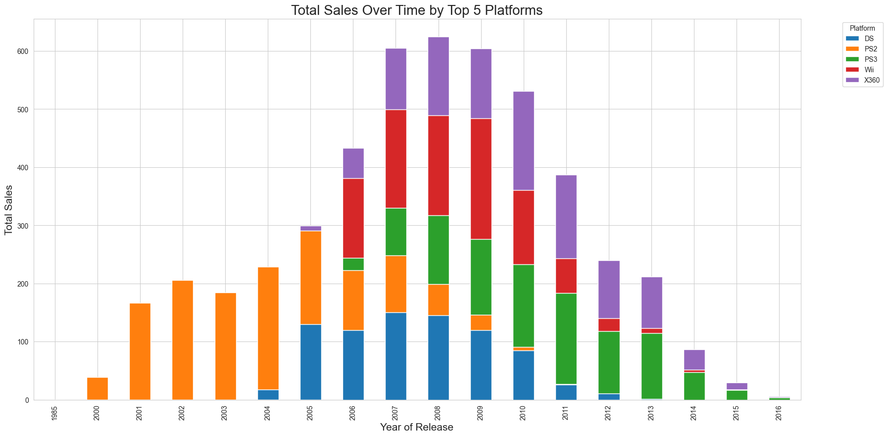
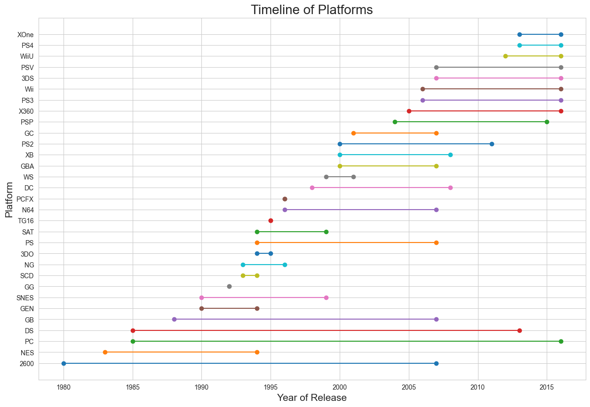

# 🎮 Game Success Predictor
This is the first integrated project as part of TripleTen's Data Science program. It focuses on analyzing and predicting the success of video games using advanced data analysis techniques. The primary objectives are to deliver accurate success predictions, support decision-making in the gaming industry, and optimize marketing and development strategies.

## 🚀 Features
- **Data Preprocessing**: Cleaning and preparing video game sales and metadata for analysis.
- **Exploratory Data Analysis (EDA)**: Identifying trends, patterns, and correlations in the gaming industry.
- **Feature Engineering**: Customizing features to enhance prediction accuracy for game success.
- **Region Analysis**: Analyzing game performance across different geographic regions to uncover regional preferences.
- **Hypothesis Testing**: Validating assumptions about factors influencing game success using statistical methods.
- **Business Insights**: Providing actionable recommendations for game development and marketing strategies based on data-driven findings. 

## 📊 Visuals

This project includes a variety of visualizations to support data-driven insights:

- **Sales Trends**: Line and bar charts showing sales performance over time and across regions.
- **Genre Popularity**: Pie and bar charts illustrating the distribution of game genres.
- **Correlation Heatmaps**: Visual representations of relationships between key features.
- **Model Performance**: Plots comparing predicted vs. actual values and visualizing error metrics.
- **Regional Analysis**: Maps and charts highlighting differences in game success by region.

All visuals are generated within the Jupyter Notebook and can be customized for further exploration. 

The dataset originally covers video game data from 1980 to 2016. However, to ensure that predictions for 2017 are based on the most relevant trends, the data has been filtered to include only entries from 2012 to 2016. 

 

 

 


## 📦 Installation

```bash
# Clone the repository
git clone https://github.com/Vyncent-vdW/game_success.git

# Navigate into the project directory
cd game_success

# (Optional) Create and activate a virtual environment
python -m venv venv
source venv/bin/activate  # On Windows: venv\Scripts\activate

# Install required dependencies
pip install -r requirements.txt
```

## 🛠️ Usage
Run the Jupyter Notebook to explore the full workflow:

```bash
jupyter notebook games_df.ipynb
``` 

Key sections:

- Load and preprocess the dataset to ensure data quality and consistency.
- Conduct exploratory data analysis (EDA) to uncover trends, patterns, and relationships in the gaming industry.
- Train and compare various regression models to identify the best-performing approach.
- Assess model performance using metrics like RMSE and cross-validation.
- Extract actionable insights to support decision-making and optimize game development and marketing strategies.

## ✅ Requirements 
- Python 3.8+
- pandas
- scikit-learn
- NumPy
- Matplotlib / Seaborn
- Jupyter Notebook 

Install them with: 
```bash
pip install -r requirements.txt
``` 

## 🙋 Contributing
Feel free to fork this repo and improve it. If you’ve got enhancements (e.g., better models, new features, business insights), submit a pull request:

1. Fork the repo

2. Create a new branch: git checkout -b feature-name

3. Commit your changes: git commit -m "Add improvement"

4. Push to your fork: git push origin feature-name

5. Submit a pull request 

## ✨ Acknowledgements 
TripleTen Game Success dataset source: 

- https://practicum-content.s3.us-west-1.amazonaws.com/datasets/games.csv